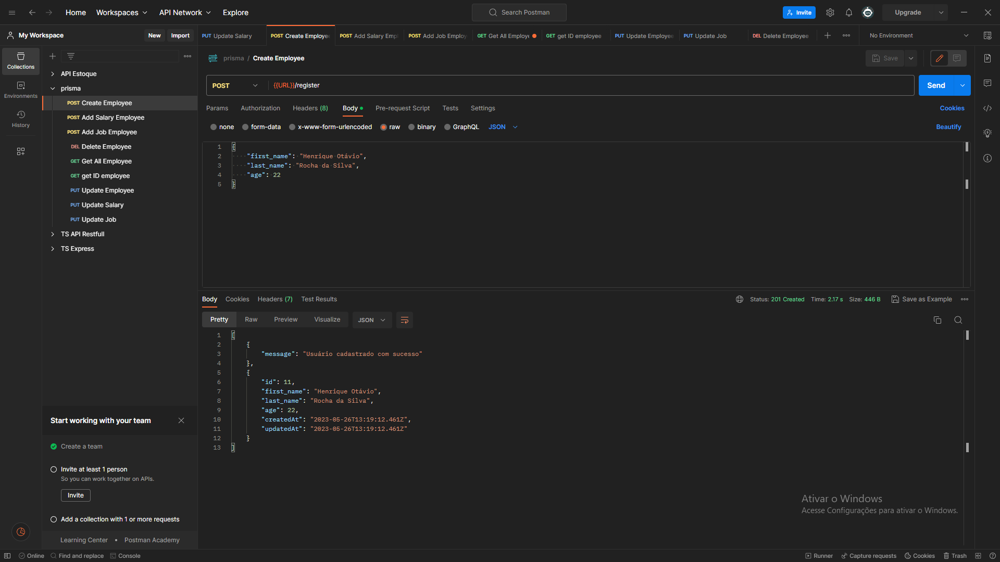
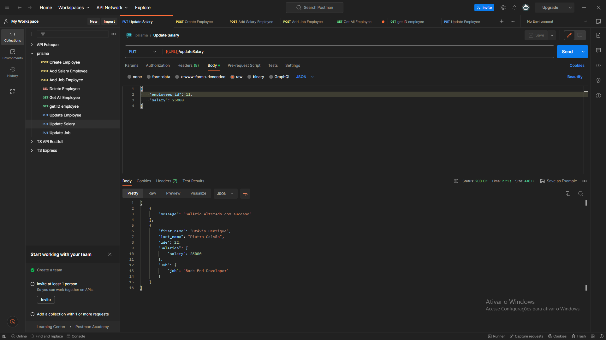

# Projeto - API Gerenciamento de Funcionários 

### Tecnologias utilizadas no projeto:
* NodeJS
* TypeScript
* Prisma
* MySQL
* Express
  
Projeto desenvolvido criando uma API para gerenciamento de uma empresa. Neste projeto
existem 3 tabelas no banco de dados (tabela de funcionários, salários e cargo) todas as 3
se ligam por meio de foreign key (chave estrangeira) para se comunicarem. Na tabela de funcionários,
o seu ID possui o efeito cascade (cascata), sendo assim, quando um funcionário é excluido, seus dados
salvos na tabela CARGO e na tabela SALÁRIOS também são excluidos. A tabela funcionário possui um CRUD,
já as tabelas cargos e salários possuem apenas métodos de POST e PUT, pelo motivo que não faz sentido o método DELETE
pois não tem lógica excluir o salário ou cargo de um funcionário sem exluir o mesmo, sendo assim, se quiser excluir um salário
ou um cargo é necessário excluir o funcionário da tabela funcionário, o método GET também não foi criado pois não faz sentido
obter APENAS os salários e o cargo do funcionário, e sim obter todas as informações dele (com cargo e salários inclusos), sendo assim,
se quiser obter o salário e o cargo do funcionário utilize o request com os endpoints de employees que irão te retornar todos os dados completos

## Imagens das Requests.
### Resgitro de funcionário

